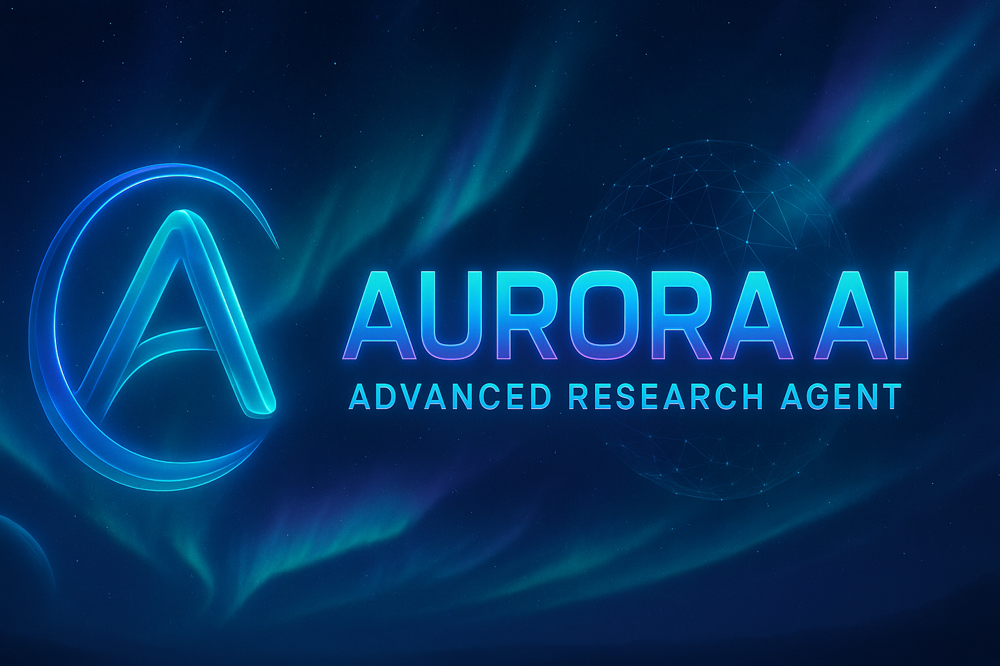
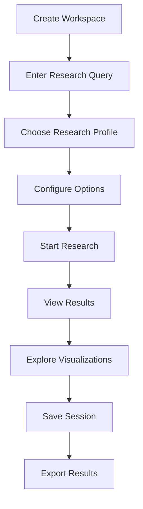

# 🌌 Aurora AI – Advanced Research Agent

<div align="center">
  
</div>

<div align="center">
  
**Your intelligent research companion delivering real-time, fact-checked insights with interactive visualizations**

[](https://aurora-ai-eight.vercel.app/)
[](LICENSE)
[](https://nextjs.org/)
[](https://openai.com/)

</div>

---

## 📌 What is Aurora AI?

Aurora AI is a next-generation AI research agent that transforms how information is gathered, analyzed, and visualized. Leveraging cutting-edge technologies like Next.js 15, OpenAI's GPT-4, and advanced visualization libraries, Aurora AI delivers real-time, fact-checked research insights through an intuitive and visually stunning interface.

### 🌟 Core Value Proposition
- **Real-Time Intelligence**: Access the latest information from the web, processed and summarized in seconds
- **AI-Powered Accuracy**: Advanced fact-checking and intelligent summarization using GPT-4
- **Interactive Exploration**: Dynamic knowledge graphs and timelines for deep research understanding
- **Seamless Organization**: Workspace management and research history for efficient project handling
- **Professional Output**: Export capabilities for sharing research in multiple formats

---

## ✨ Key Features

| Feature | Description | Technology |
|---------|-------------|------------|
| 🔍 **Real-Time Research** | Instant information retrieval and processing from web sources | Web APIs, OpenAI |
| 🧠 **AI-Powered Analysis** | Intelligent summarization and fact-checking with GPT-4 | OpenAI GPT-4 |
| 📊 **Interactive Visualization** | Dynamic knowledge graphs and timelines for data exploration | D3.js, Three.js |
| 🗂️ **Workspace Management** | Organize research projects into dedicated workspaces | Custom UI |
| 📚 **Research History** | Save and revisit previous research sessions | Neon Database |
| 📤 **Export Functionality** | Export results as PDF or Markdown files | Custom Export Engine |
| 📱 **Responsive Design** | Seamless experience across desktop and mobile devices | Tailwind CSS |
| 🎨 **Modern UI** | Professional interface with 3D effects and animations | Framer Motion, Three.js |

---

## 🛠️ Technology Stack

<div align="center">

| Category | Technologies |
|----------|--------------|
| **Frontend** |    |
| **Styling** |  |
| **Animation** |  |
| **Visualization** |   |
| **Backend** |  |
| **Database** |  |
| **AI** |  |
| **UI Components** |   |

</div>

---

## 📦 Environment Configuration

Create a `.env.local` file in the root directory with the following variables:

| Variable | Purpose | Required |
|----------|---------|----------|
| `OPENAI_API_KEY` | OpenAI API access for GPT-4 | Yes |
| `DATABASE_URL` | Neon Database connection string | Yes |

> ⚠️ **Security Note**: Never commit your `.env.local` file to version control. Add it to your `.gitignore` file.

---

## 🚀 Getting Started

### Prerequisites
- Node.js 18.0 or later
- npm or yarn package manager
- OpenAI API key
- Neon Database account

### Installation

1. **Clone the repository**
   ```bash
   git clone https://github.com/your-username/aurora-ai.git
   cd aurora-ai
   ```

2. **Install dependencies**
   ```bash
   npm install
   ```

3. **Set up environment variables**
   - Create a `.env.local` file in the root directory
   - Add your OpenAI API key and Neon Database connection string

4. **Set up the database**
   - Create a Neon Database account at [neon.tech](https://neon.tech)
   - Create a new project and copy the connection string
   - Add the connection string to your `.env.local` file as `DATABASE_URL`

5. **Run the development server**
   ```bash
   npm run dev
   ```

6. **Open your browser**
   Navigate to [http://localhost:3000](http://localhost:3000)

---

## 🗄 Database Setup

The application uses Neon Database for persistent storage. The database tables are automatically created when you first run the application.

### Required Tables
1. **workspaces**: Stores user workspaces for organizing research
2. **research_sessions**: Stores research queries, options, and results

The tables will be created automatically when you first load the dashboard.

---

## 🚀 Deployment

### Vercel Deployment

1. **Push your code to GitHub**
   Make sure your code is in a GitHub repository.

2. **Deploy to Vercel**
   - Go to [vercel.com](https://vercel.com)
   - Import your GitHub repository
   - Add environment variables:
     - `OPENAI_API_KEY`
     - `DATABASE_URL`
   - Deploy

The application is optimized for Vercel deployment with serverless functions and edge caching.

### Environment Variables for Production
Make sure to add the following environment variables in your Vercel dashboard:
- `OPENAI_API_KEY`: Your OpenAI API key
- `DATABASE_URL`: Your Neon Database connection string

---

## 📝 Usage

<div align="center">



</div>

### Starting a Research Query

1. **Select or create a workspace** in the dashboard
2. **Enter your research query** in the input field
3. **Choose a research profile**:
   - Academic: Formal, citation-focused research
   - Journalist: Investigative, source-verified reporting
   - Analyst: Data-driven, trend-focused analysis
4. **Configure advanced options** (optional):
   - Data sources
   - Date range
   - Location filter
5. **Click "Research"** to start the process

### Viewing Results

The research results are displayed in multiple tabs:
- **Summary**: AI-generated research summary
- **Sources**: List of sources used in the research
- **Timeline**: Chronological events related to the research
- **Graph**: Interactive knowledge graph showing entity relationships
- **Export**: Options to export results as PDF or Markdown

### Managing Workspaces

- Create new workspaces to organize different research projects
- Each workspace maintains its own research history
- Workspaces can be shared (simulated in the current version)

### Research History

- All research sessions are saved automatically
- View previous research sessions in the History tab
- Click on any session to view detailed results

---

## 🔒 Security

- **API Key Protection**  
  OpenAI API keys are stored securely in environment variables and never exposed to the client

- **Database Security**  
  Neon Database provides secure connections with encryption at rest and in transit

- **Authentication**  
  User sessions are securely managed with encrypted tokens

- **Data Privacy**  
  No personal data is shared with third parties beyond what's necessary for research processing

---

## 📊 Performance

- **Edge Computing**  
  Vercel Edge Functions ensure fast response times globally

- **Database Optimization**  
  Neon Database provides instant scaling and efficient query processing

- **Frontend Optimization**  
  Code-splitting, lazy loading, and optimized rendering ensure smooth performance

- **Caching**  
  Intelligent caching strategies minimize redundant API calls and database queries

---

## 🤝 Contributing

We welcome contributions from the community! Here's how you can help:

1. **Report Bugs**  
   Open an issue describing the problem in detail

2. **Suggest Features**  
   Share your ideas for new functionality or improvements

3. **Submit Pull Requests**  
   Fork the repository, make your changes, and submit a PR for review

4. **Improve Documentation**  
   Help us make our documentation clearer and more comprehensive

---

## 🙏 Acknowledgements

We're grateful to these amazing projects and services that make Aurora AI possible:

- **OpenAI** for GPT-4, the intelligence behind our research analysis
- **Vercel** for providing an excellent platform for deployment and edge functions
- **Neon** for the scalable database solution
- **shadcn/ui** for beautiful, accessible components
- **Three.js** and **D3.js** for enabling stunning visualizations
- **Framer Motion** for smooth animations and interactions

---

## 🔒 License

This project is licensed under the MIT License - see the [LICENSE](LICENSE) file for details.

<div align="center">

**© 2025 Mohit Bansal. All rights reserved.**

[](https://aurora-ai-eight.vercel.app/)
[](https://github.com/your-username/aurora-ai)

</div>
